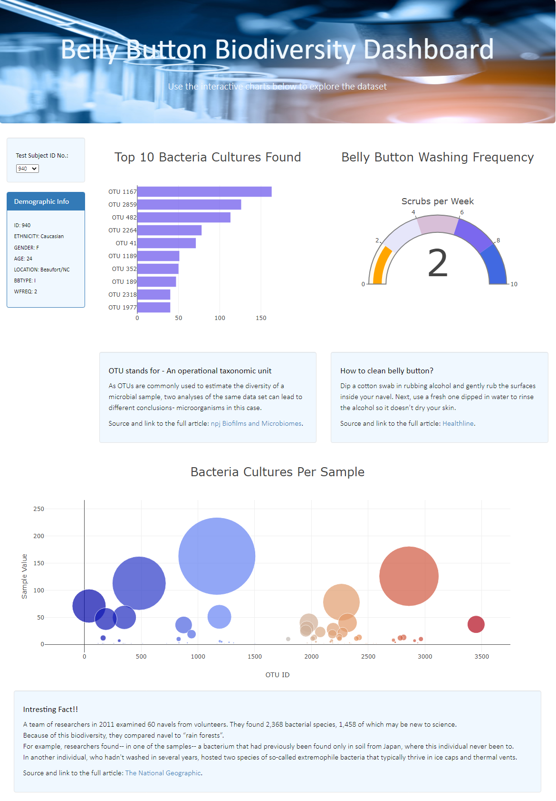

# Plotly_Deploy

## Project Overview

For this project we need to create interactive dashboard to demonstrate Belly Button Biodiversity. So that we can identify the top 10 bacterial species of belly button and that way we can identify improbable species of bacteria to manufacture Synthetic Beef.

## Purpose

- Visualize the data for better understanding to draw some conclusions as researchers and data analysts.
- The purpose of this research is to **gather, identify and analyze the biological data of individuals’ navels**.
- The research holds data of 153 individuals and their: 
  -	Unique and anonyms ID.
  -	Demographic information.
  -	Belly button scrubbing frequency.
  -	Belly button biological footprint.

## Requirements

- Create a Horizontal Bar Chart
- Create a Bubble Chart
- Create a Gauge Chart
- Customize the Dashboard

The individual can find information by **selecting unique ID from a drop-down menu** and explore data by deep dive in their own results or compare the results to other individuals. **This research is also public and easily accessible**, so anyone can learn more about belly button biodiversity and explore this fascinating field. 

 
 

 <b>Belly Button Biodiversity Interactive Dashboard:</b> https://snehajoshi11.github.io/plotly_deploy/ 

 

<i>Figure 1: Dashboard Preview</i>

## Resources 

- **JavaScript, Plotly.js**
    - Advantage of **JavaScript** and **Plotly.js** library is that there is no need of additional programs to installed on their computers in order to *“run the code” *.
    - JavaScript enables to create visualizations that are attractive, accessible, and interactive.
    - The table is built by inserting **JavaScript** and **Plotly** into HTML page [charts.js](charts.js).
    
- **Data**
    - The data, stored in a json file [samples.json]( samples.json).

- **HTML**
    - To build the webpage [index.html](index.html).
    
- **CSS and Bootstrap**
    - To style the page [style.css](css/style.css)

- **Chrome Developer Tools to test the code.**
 
- **GitHub**
    - To deploy and showcase the final results [Belly Button Biodiversity Dashboard](https://snehajoshi11.github.io/plotly_deploy/).

